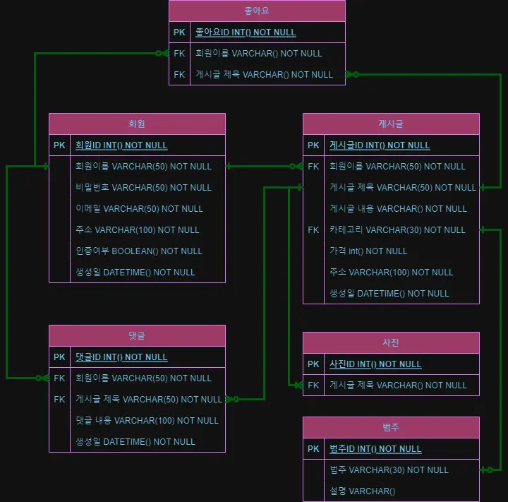
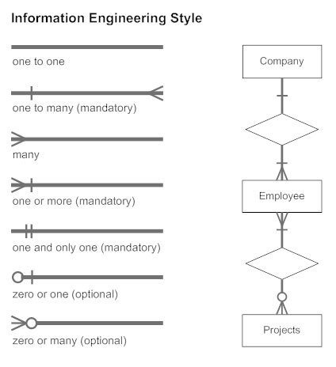

- 외래키
    - Foreign key.
    - 테이블의 연관 관계를 나타내는 키. 서로를 연결하기 위한 역할이다.
    - 외래 키는 한 테이블의 필드이고, 다른 테이블의 기본 키를 나타낸다.
    - 외래 키를 갖는 테이블을 하위 테이블, 기본 키를 갖는 테이블을 상위 테이블이라고 한다.
    - 각 외래 키와 기본 키는 1:1로 맵핑되며 기본키에 존재하지 않는 값은 외래 키에 존재할 수 없다. (외래 키 제한 표현)
        - 예를 들어 외래 키의 값으로 10이라는 값이 있을 때 상위 테이블 기본 키의 값에 10이라는 값이 없다면, 외래 키 제한 표현에 의해 에러가 발생한다.
    
    ```sql
    CREATE TABLE country (
     country_id integer,
     name varchar(50),
     population integer
    );
    
    CREATE TABLE city (
     city_id integer,
     name varchar(50),
     country_id integer,
     PRIMARY KEY (city_id),
     FOREIGN KEY (country_id) REFERENCES country(country_id)
    );
    ```
    
- 기본키
    - Primary Key.
    - 데이터베이스 테이블 내의 레코드에서 고유한 값 제공.
    - 서로 다른 값을 가지고 있어 각 레코드를 식별할 수 있다.
    - NULL 값이 존재할 수 없다.
    - 레코드 값은 중복될 수 없다.
    - 테이블에 하나의 기본키를 가질 수 있지만 경우에 따라 1개 이상의 기본키를 정의할 수 있다. (복합 기본 키 등)
    
    ```sql
    CREATE TABLE user {
    	id int PRIMARY KEY AUTO_INCREMENT
    }
    ```
    
    https://velog.io/@hiy7030/DB-Primary-key%EC%99%80-foreign-key
    
- ER 다이어그램
    - Entity Relationship Diagram
    - 데이터베이스 설계 과정에서 사용되는 모델링 기법. 데이터에 저장되 데이터 엔티티들과 엔티티들 간의 관계를 시각적으로 표현하는 다이어그램이다. 데이터베이스 설계의 초기 단계에서 개념적 모델을 만드는 데 사용된다.
    
    
    
    [https://nbcamp.spartacodingclub.kr/blog/erd-개체-관계-이해를-돕는-팁-19137](https://nbcamp.spartacodingclub.kr/blog/erd-%EA%B0%9C%EC%B2%B4-%EA%B4%80%EA%B3%84-%EC%9D%B4%ED%95%B4%EB%A5%BC-%EB%8F%95%EB%8A%94-%ED%8C%81-19137)
    
- 복합 키
    - Composite key.
    - 복합 기본키라고 한다. 두 개 이상의 컬럼으로 구성된 기본키를 의미한다. 하나의 칼럼으로 레코드의 고유성을 보장하기 어려울 때 두 개 이상의 칼럼을 결합하여 고유한 키를 생성한다.
    - 데이터 무결성을 보장할 수 있고, 정규화 과정에서 발생하는 테이블 간의 관계를 나타내는 데 사용된다.
    
    ```sql
    -- 대여 정보 테이블 생성
    CREATE TABLE InternationalBookRental (
        libraryCode VARCHAR(10),
        bookCode VARCHAR(10),
        rentalDate DATE,
        returnDate DATE,
    
        PRIMARY KEY (libraryCode, bookCode) -- 복합키 설정
    );
    
    -- 대여 정보 입력 예시
    INSERT INTO InternationalBookRental (libraryCode, bookCode, rentalDate) 
    VALUES ('LIB123', 'BK001', '2023-01-01');
    ```
    
    https://shin-e-dog.tistory.com/66
    
- 연관관계
    
    
    
    - 관계형 데이터베이스에서 각 테이블 사이에는 관계라는 개념이 존재한다.
    - 1:1 관계
        - 하나의 레코드가 다른 테이블의 레코드 한 개와 연결된 경우.
        - 하나의 식당에는 하나의 식당 카테고리를 갖는 것이 1:1 관계이다.
    - 1:N 관계
        - 하나의 레코드가 서로 다른 여러 개의 레코드와 연결된 경우.
        - 하나의 유저에게 여러 개의 미션이 할당되는 것이 1:1 관계이다.
    - N:M 관계
        - 다대다 관계는 여러 개의 레코드가 다른 테이블의 여러 개의 레코드와 관계가 있는 경우.
        - 유저가 여러 개의 선호 음식을 가질 수 있고, 선호 음식 또한 여러 명의 유저에게 할당될 수 있는 것이 N:M 관계이다.
    - 자기 참조 관계
        - 하나의 테이블 내에서 관계를 표현하는 경우.
        - 추천인 ID를 입력하는 등의 기능에 사용된다.
    
    https://sum0725.tistory.com/12
    
    https://ittrue.tistory.com/201
    
- 정규화
    
    [정보처리 실기_데이터베이스06강_정규화](https://youtu.be/RXQ1kZ_JHqg?si=f0OPsoOWnJXSbqca)
    
    - 이상현상이 있는 릴레이션(테이블)을 분해하여 이상현상을 없애는 과정이다. 테이블 간에 중복된 데이터를 허용하지 않는 것이다.
    - 무결성을 유지하고 DB의 저장 용량을 줄일 수 있다.
        - 장점
            - 데이터베이스를 변경할 때의 이상 현상을 줄일 수 있다.
            - 새로운 데이터 형의 추가로 인한 확장 시 구조를 변경하지 않아도 된거나 일부만 변경해도 된다.
            - 배포된 프로그램에 적은 영향을 미치게 된다.
        - 단점
            - 테이블 간의 JOIN연산이 많아져 응답 시간이 느려질 수 있다.
            - 성능 저하가 나타날 경우, 반정규화를 적용한다.
    - 정규화 단계
        - 제 1 정규화
            - 각 컬럼이 하나의 속성만을 가진다.
            - 하나의 컬럼은 같은 종류나 타입의 값을 가져야한다.
            - 각 컬럼이 유일한 이름을 가져야한다.
            - 칼럼의 순서가 상관없어야 한다.
            
            | 이름 | 나이 | 수강과목 |
            | --- | --- | --- |
            | 홍길동 | 20 | C,C++ |
            | 이순신 | 21 | Java |
            | 이 산 | 22 | DB, 운영체제 |
            
            | 이름 | 나이 | 수강과목 |
            | --- | --- | --- |
            | 홍길동 | 20 | C |
            | 홍길동 | 20 | C++ |
            | 이순신 | 21 | Java |
            | 이 산 | 22 | DB |
            | 이 산 | 22 | 운영체제 |
        - 제 2 정규화
            - 제 1 정규화를 진행한 테이블에 대해 완전 함수 종속을 만족하도록 테이블을 분해한다.
            - 완전 함수 종속 - 기본키의 부분집합이 결정자가 되어선 안된다.
            - 모든 컬럼이 부분적 종속이 없어야한다.
            
            | 학생 이름 | 나이 | 수강과목 |
            | --- | --- | --- |
            | 홍길동 | 20 | C |
            | 홍길동 | 20 | C++ |
            | 이순신 | 21 | Java |
            | 이 산 | 22 | DB |
            | 이 산 | 22 | 운영체제 |
            
            | 학생 이름 | 나이 |
            | --- | --- |
            | 홍길동 | 20 |
            | 이순신 | 21 |
            | 이 산 | 22 |
            
            | 학생 이름 | 수강과목 |
            | --- | --- |
            | 홍길동 | C |
            | 홍길동 | C++ |
            | 이순신 | Java |
            | 이 산 | DB |
            | 이 산 | 운영체제 |
        - 제 3 정규화
            - 제 2정규화를 진행한 테이블에 대해 이행적 종속을 없애도록 테이블을 분해한다.
            - A→B, B→C가 성립할 때 A→C가 성립되는 것이 이행적 종속이다.
            
            | 학생 코드 | 학생이름 | DOB | Street | City | State | ZIP |
            | --- | --- | --- | --- | --- | --- | --- |
            
            | 학생 코드 | 학생 이름 | DOB | ZIP |
            | --- | --- | --- | --- |
            
            | ZIP | Street | City | State |
            | --- | --- | --- | --- |
    
    https://superohinsung.tistory.com/111
    
- 반 정규화
    - De-normalizaion - 정규화된 엔티티, 속성, 관계에 대해 시스템의 성능 향상, 개발과 운영의 단순화를 위해 중복, 통합, 분리 등을 수행하는 데이터 모델링 기법.
    - 데이터 무결성이 깨질 수 있지만 JOIN으로 인한 성능저하가 예상될 경우 수행한다.
    - 절차
        1. 반정규화 대상 조사
            1. 범위처리빈도수 조사
            2. 테이블 조인 개수 조사
        2. 다른 방법 유도
            1. 뷰 테이블
            2. 클러스터링
            3. 인덱스 조정
        3. 반정규화 적용
    - 기법
        1. 테이블 병합
        2. 테이블 분할
        3. 테이블 추가
    
    [https://velog.io/@dddooo9/데이터베이스-반정규화](https://velog.io/@dddooo9/%EB%8D%B0%EC%9D%B4%ED%84%B0%EB%B2%A0%EC%9D%B4%EC%8A%A4-%EB%B0%98%EC%A0%95%EA%B7%9C%ED%99%94)