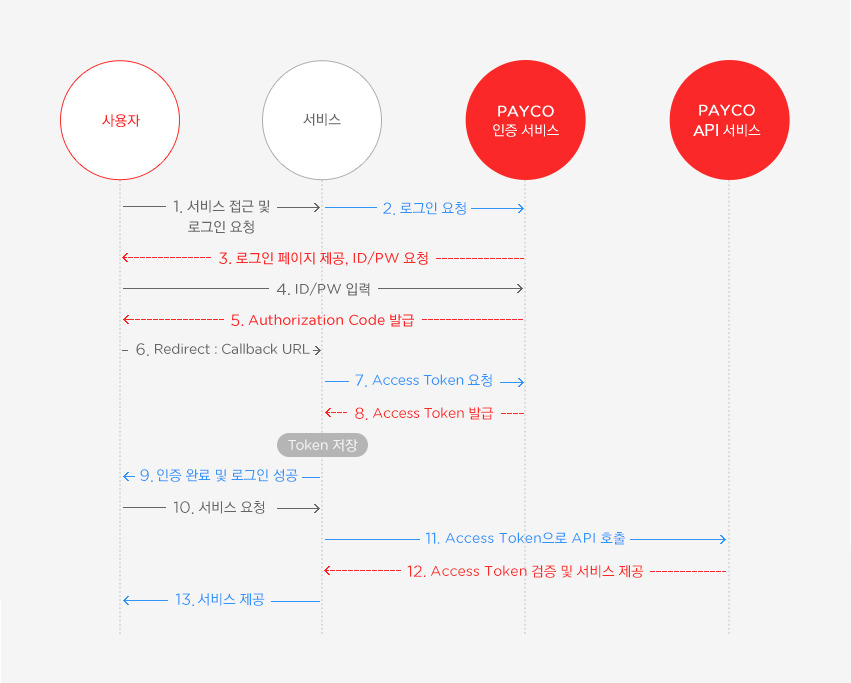

- OAuth 2.0
    - OAuth - Open Authorization
    - 인터넷 사용자들이 비밀번호를 제공하지 않고 다른 웹 사이트 상의 본인 개인정보를 활용하여 웹 사이트나 어플리케이션의 접근 권한을 부여하는 접근 방식의 표준.
    - 외부 사이트 (naver, kakao, google 등)의 api를 통하여 인증을 대신 해주는 것이라고 생각하면 된다.
    - 간단한 과정을 표현한 그림
    
    
    
    - OAuth 용어
        - 액세스 토큰 - 클라이언트가 리소스 서버에 접근하기 위한 권한을 부여받는 토큰. Authorization Server에서 발급되고, 유효 기간이 존재한다.
        - 리프레시 토큰 - 리프레시 토큰은 액세스 토큰이 만료된 후 새로운 액세스 토큰을 받기 위한 토큰이다. 다시 로그인할 필요 없이 유효 시간 갱신만으로 계속 애플리케이션을 사용할 수 있다.
        - 범위(Scope) - 클라이언트가 리소스에 대한 어떤 작업을 수행할 수 있는지 정의하는 문자열. 권한 서버에 의해 정의된다.
        - 인증 코드(Authorization Code) - 인증 코드는 클라이언트가 액세스 토큰을 얻기 위한 중간 단계로 사용되는 코드이다. Authorization Server에서 발급되며, 이를 사용하여 액세스 토큰과 리프레시 토큰을 얻을 수 있다.
    - OAuth의 역할들
        - Resource Owner - 리소스 소유자. 보호된 자원에 접근할 수 있는 자격을 부여해 주는 주체이며 클라이언트를 인증하는 역할을 수행하고 권한을 클라이언트에게 부여한다.
        - Client - 보호된 자원에 접근을 요청하는 애플리케이션
        - Resource Server - 사용자의 보호된 자원을 호스팅하는 서버
        - Authorization Server - 인증/인가를 수행하는 서버. 클라이언트의 접근 자격을 확인하고 토큰을 발급해주는 역할을 수행한다.
- HTTP Cookie
    - 서버가 사용자의 웹 브라우저에 전송하는 작은 데이터 조각이다. 브라우저는 쿠키를 저장해 놓았다가 동일한 서버에 재요청 시 저장된 쿠키의 데이터를 함께 전송한다. 동일한 브라우저에서 들어왔는지 아닌지 판단할 수 있다.
    - 크게 세 가지 목적이 있다.
        1. 세션 관리 - 서버에 저장해야 하는 로그인, 장바구니 등등의 정보
        2. 개인화 - 사용자 선호 테마 등 개인 선호도 요소
        3. 트래킹 - 사용자 행동을 기록하고 분석하는 용도
    - 쿠키의 구조
        - sessionId - 로그인시 생성되는 session의 id. 다른 민감한 로그인 정보 대신 이 id값만 쿠키에 저장한다.
        - expires - 쿠키의 수명. 만기일에 도달하면 쿠키는 삭제된다.
        - domain - 쿠키가 사용될 수 있는 도메인 값을 넣어줄 수 있다. 값을 생략하는 경우 쿠키가 생성된 도메인 기준으로 저장된다.