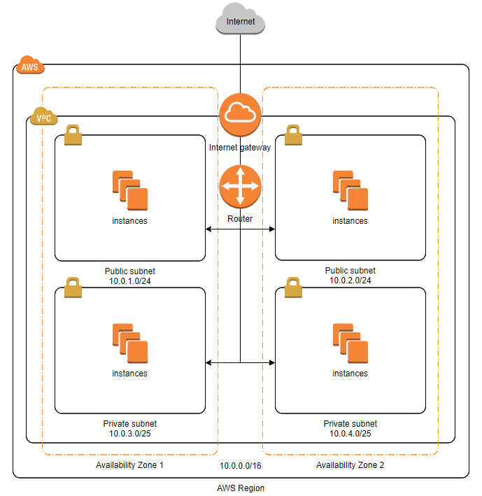

- AWS
    - Amazon Web Service - 서버, 네트워크 등의 인프라를 전체로 빌려주는 서비스.
    - EC2, S3 등의 서비스가 대표적이며 AWS만으로 필요한 기능을 대부분 구축할 수 있다.
- 리전과 가용영역
    - 리전 - AWS가 전 세계에서 데이터 센터를 클러스터링하는 물리적 위치.
    - 가용영역(AZ) - AWS 리전의 중복 전력, 네트워킹 및 연결이 제공되는 하나 이상의 개별 데이터 센터로 구성된 영역.
    - 리전 내의 논리적 데이터 센터의 그룹 하나 하나를 가용영역이라고 한다. 각 리전은 지리적 영역 내에서 서로 분리되어 있는 최소 3개의 가용영역으로 이루어져있다.
    - 각 가용영역은 독립된 전원, 냉각 및 물리적 보안을 갖추고 있으며 빠른 중복 네트워크를 통해 연결된다.
    - 따라서 가용영역의 분리에 따른 가용영역 간의 전용 네트워크 통신으로 애플리케이션 분할이 용이하다.
- 서브네팅
    - IP주소를 효율적으로 사용하기 위해서 네트워크를 나누는 과정. 자신의 네트워크를 더 작은 서브 네트워크로 나누는 것.
    - 장점
        1. 효율성 - 낭비되는 IP 주소를 효율적으로 관리할 수 있고, 네트워크를 잘게 나누어서 용도를 분리해서 관리할 수 있다.
        2. 성능 - 브로드캐스팅시 모든 호스트에 전송하게 되는데, 서브네팅으로 한번의 브로드캐스트에 너무 많은 트래픽이 생기지 않도록 할 수 있다.
        3. 보안 - 네트워크를 분리하여 서로 다른 네트워크로 취급할 수 있다.
    - 과거에는 classful IPv4로 네트워크를 분리했지만 요즘은 CIDR 방식으로 IP 주소를 할당한다. 서브넷 마스크가 가변 길이이므로 네트워크를 더 세분화할 수 있다.
- 라우팅
    - 네트워크에서 경로를 선택하는 프로세스.
    - 컴퓨터 네트워크는 노드라고 하는 여러 시스템과 노드를 연결하는 링크로 구성된다.
    - 라우팅은 미리 정해진 규칙을 사용하여 최상의 경로를 선택하는 프로세스.
    - 주요 라우팅 프로토콜 두가지
        - 내부 게이트웨이 - 관리자가 제어하는 네트워크인 자율 시스템에서 동작. Routing Information Protocol, Open Shortest Path First Protocol 등이 있다.
        - 외부 게이트웨이 - 두 자율 시스템 간의 정보 전송을 관리하는데 적합한 프로토콜. Border Gateway Protocol이 있다.
    - AWS Transit Gateway, Amazon VPC 등의 AWS 서비스가 존재한다.
- VPC
    - 사용자가 정의한 가상 네트워크망을 구성하고 내부에 각종 리소스를 탑재할 수 있는 서비스.
    - Amazon EC2 등이 VPC에 해당한다.
    - 고유의 사설 IP와 인터페이스를 갖게 되며 외부에 공인될 자원인 경우 공인 IP를 보유할 수 있다.
    - 아마존 VPC는 다음과 같은 규격에 따라 프라이빗 IPv4 주소 범위에 속하는 CIDR 블록을 지정해야 한다.
        - 10.0.0.0 - 10.255.255.255
        - 172.16.0.0 - 172.31.255.255
        - 192.168.0.0 - 192.168.255.255
        - VPC 생성시 허용되는 블록 크기는 /28 넷마스크 ~ /16 넷마스크이다.
    
    
    
    - VPC를 서브네팅하여 쪼개면 각 서브넷은 하나의 AZ에 할당된다.
    - 각 서브넷은 동일한 네트워크 내에서 통신시 라우팅 테이블이 필요하지 않다.
    - AWS의 관리용 IP는 사용자가 사용할 수 없다.
        - 10.0.1.0 - 네트워크 주소
        - 10.0.1.1 - VPC 라우터용으로 예약한 주소
        - 10.0.1.2 - AWS에서 예약한 주소. DNS 서버의 IP 주소는 기본 VPC 네트워크 범위에 2를 더한 주소이다.
        - 10.0.1.3 - AWS에서 앞으로 사용하려고 예약한 주소
        - 10.0.1.255 - 브로드캐스트 주소.
- 사설 IP 주소
    - 일반 가정이나 회사 내 등에 할당된 네트워크의 IP 주소. 로컬 IP 혹은 가상 IP라고도 한다. 라우터에 의해 로컬 네트워크 상의 PC나 장치에 할당된다.
    - 다음 3가지 주소대역으로 고정된다.
        - Class A : 10.0.0.0 ~ 10.255.255.255
        - Class B : 172.16.0.0 ~ 172.16.255.255
        - Class C : 192.168.0.0 ~ 192.168.255.255
    - 공인 IP 와의 차이
        - 할당 주체: 공인 IP는 ISP에서 할당된 주소이며, 사설 IP는 라우터에서 할당된 주소이다.
        - 할당 대상: 개인 또는 회사의 서버(라우터) / 개인 또는 회사의 기기
        - 고유성: 인터넷 상에서 유일한 주소 / 하나의 네트워크 안에서 유일한 주소
        - 공개 여부: 내/외부 접근 가능 / 외부접근 불가능
- 포트포워딩
    - 공유기의 포트를 통해 이 공유기와 연결된 기기들의 특정 포트에 진입할 수 있게 하는 기능. 공유기에 연결된 기기의 포트를 특정 번호를 통해 전달해 주는 것.
    - 네트워크 게이트웨이를 통과하는 동안 네트워크 주소를 전환하여 외부에서 접속이 가능하도록 하는 것이다.
- NAT 프로토콜
    - IP 주소 혹은 IP 패킷의 TCP/UDP 포트 숫자를 변화하고 재기록하여 네트워크 트래픽을 주고받는 기술.
    - 공인망으로 나아가기 위해 사설망의 IP 주소를 공인 IP 로 변환하고, 반대로 공인망에서 온 정보를 받기 위해 공인 IP를 사설망의 IP로 변환한다.
- 포트 번호
    - TCP/IP 네트워크에서 특정 프로세스나 서비스를 식별하기 위해 사용되는 숫자. IP 주소가 호스트 기기를 식별한다면 포트 번호는 해당 기기 내에서 특정 애플리케이션이나 서비스를 구분하는 역할을 한다.
    - 포트 번호는 0 ~ 65535까지 사용할 수 있다.
        - Well-know port - 0~1023 - 시스템 사용 번호
        - Registered  port - 1024~49151 - 특정 프로토콜이나 애플리케이션에서 사용하는 번호
        - Dynamic port - 49152~65535 - 애플리케이션에서 사용하거나 임시로 사용하는 번호
    - 자주 사용되는 포트번호
        - 80 - HTTP
        - 443 - HTTPS
        - 110 - POP3
        - 25 - SMTP
        - 22 - SSH
        - 53 - DNS
        - 123 - NTP
        - 20 - FTP
        - 21 - FTP 제어