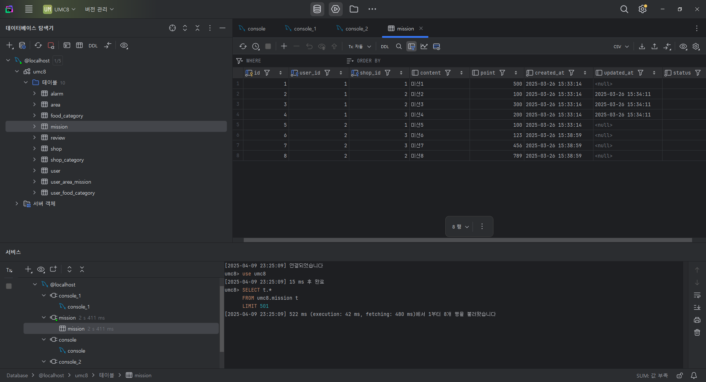
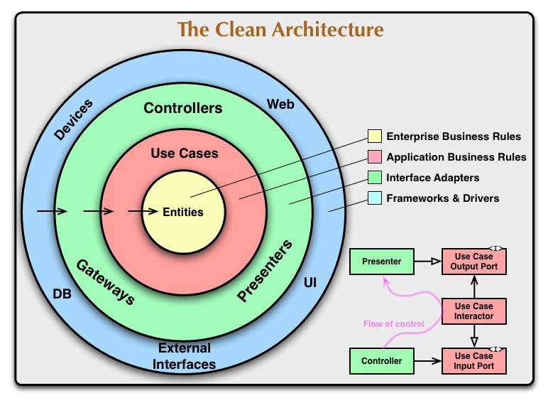

1. 테이블 생성 결과
    
    ERD cloud에서 생성한 DDL을 기반으로 SQL을 자동 생성하고 만들었다.
    
    ```sql
    SET sql_mode='';
    
    CREATE TABLE `mission` (
        `id` INT NOT NULL AUTO_INCREMENT,
        `user_id` INT NOT NULL,
        `shop_id` INT NOT NULL,
        `content` TEXT NULL,
        `point` INT NULL,
        `created_at` TIMESTAMP NOT NULL DEFAULT CURRENT_TIMESTAMP,
        `updated_at` TIMESTAMP NULL ON UPDATE CURRENT_TIMESTAMP,
        `status` TINYINT NOT NULL DEFAULT 1,
        PRIMARY KEY (`id`),
        FOREIGN KEY (`user_id`) REFERENCES `user` (`id`) ON DELETE CASCADE,
        FOREIGN KEY (`shop_id`) REFERENCES `shop` (`id`) ON DELETE CASCADE
    );
    
    CREATE TABLE `user` (
        `id` INT NOT NULL AUTO_INCREMENT,
        `username` VARCHAR(20) NULL,
        `gender` TINYINT NULL,
        `address` VARCHAR(50) NULL,
        `email` VARCHAR(30) NULL UNIQUE,
        `phone_number` VARCHAR(20) NULL UNIQUE,
        `point` INT NOT NULL DEFAULT 0,
        PRIMARY KEY (`id`)
    );
    
    CREATE TABLE `shop` (
        `id` INT NOT NULL AUTO_INCREMENT,
        `shop_category` INT NOT NULL,
        `area_id` INT NOT NULL,
        `shop_name` VARCHAR(20) NOT NULL,
        `shop_address` VARCHAR(50) NOT NULL,
        PRIMARY KEY (`id`),
        FOREIGN KEY (`shop_category`) REFERENCES `shop_category` (`id`) ON DELETE CASCADE,
        FOREIGN KEY (`area_id`) REFERENCES `area` (`id`) ON DELETE CASCADE
    );
    
    CREATE TABLE `shop_category` (
        `id` INT NOT NULL AUTO_INCREMENT,
        `category` VARCHAR(10) NOT NULL,
        PRIMARY KEY (`id`)
    );
    
    CREATE TABLE `alarm` (
        `id` INT NOT NULL AUTO_INCREMENT,
        `user_id` INT NOT NULL,
        `alarm_title` TEXT NOT NULL,
        `alarm_content` TEXT NULL,
        `created_at` TIMESTAMP NOT NULL DEFAULT CURRENT_TIMESTAMP,
        `updated_at` TIMESTAMP NULL ON UPDATE CURRENT_TIMESTAMP,
        PRIMARY KEY (`id`),
        FOREIGN KEY (`user_id`) REFERENCES `user` (`id`) ON DELETE CASCADE
    );
    
    CREATE TABLE `review` (
        `id` INT NOT NULL AUTO_INCREMENT,
        `user_id` INT NOT NULL,
        `shop_id` INT NOT NULL,
        `review_title` TEXT NOT NULL,
        `review_content` TEXT NOT NULL,
        `review_stars` TINYINT NULL DEFAULT 0,
        `created_at` TIMESTAMP NOT NULL DEFAULT CURRENT_TIMESTAMP,
        `updated_at` TIMESTAMP NULL ON UPDATE CURRENT_TIMESTAMP,
        PRIMARY KEY (`id`),
        FOREIGN KEY (`user_id`) REFERENCES `user` (`id`) ON DELETE CASCADE,
        FOREIGN KEY (`shop_id`) REFERENCES `shop` (`id`) ON DELETE CASCADE
    );
    
    CREATE TABLE `user_food_category` (
        `user_id` INT NOT NULL,
        `food_id` INT NOT NULL,
        PRIMARY KEY (`user_id`, `food_id`),
        FOREIGN KEY (`user_id`) REFERENCES `user` (`id`) ON DELETE CASCADE,
        FOREIGN KEY (`food_id`) REFERENCES `food_category` (`id`) ON DELETE CASCADE
    );
    
    CREATE TABLE `food_category` (
        `id` INT NOT NULL AUTO_INCREMENT,
        `food` VARCHAR(10) NOT NULL,
        PRIMARY KEY (`id`)
    );
    
    CREATE TABLE `area` (
        `id` INT NOT NULL AUTO_INCREMENT,
        `area_name` VARCHAR(10) NOT NULL,
        PRIMARY KEY (`id`)
    );
    
    CREATE TABLE `user_area_mission` (
        `id` INT NOT NULL AUTO_INCREMENT,
        `user_id` INT NOT NULL,
        `area_id` INT NOT NULL,
        `required_mission` INT NULL,
        `completed_mission` INT NULL,
        PRIMARY KEY (`id`),
        FOREIGN KEY (`user_id`) REFERENCES `user` (`id`) ON DELETE CASCADE,
        FOREIGN KEY (`area_id`) REFERENCES `area` (`id`) ON DELETE CASCADE
    );
    
    ```
    
    
    
2. 프로젝트 세팅 완료
    
    node.js와 express, nodemon까지 설치완료하고 레포지토리도 생성하였다.
    
    레포지토리 주소: https://github.com/codie0226/UMC8Practice/tree/feature/chapter04
    
    
    
    
    

잘된다.

## 시니어 미션

1. ECMA Script
    
    Javascript의 기반이 되는 스크립팅 언어 명세이다. ECMA International에서 ECMA-262 기술 규격에 따라 정의되어 있다.
    
2. 년도별 정의 업데이트 목록
    1. ES 2016
        1. 제곱 연산자 (**) 추가
            
            ```jsx
            let x = 5;
            let z = x ** 2;
            ```
            
        2. Array.includes() 함수 추가
            
            ```jsx
            const fruits = ["Banana", "Orange", "Apple", "Mango"];
            
            fruits.includes("Mango");
            ```
            
            배열에 특정 값을 보유하고 있는지 확인 가능
            
    2. ES 2017
        1. String padding 기능
            
            ```jsx
            let text = "5";
            text = text.padStart(4,0);
            
            let text2 = "5";
            text2 = text2.padEnd(4,0);
            ```
            
            문자열의 시작과 끝을 특정 문자로 채워넣기
            
        2. Object.entries()
            
            ```jsx
            const fruits = {Bananas:300, Oranges:200, Apples:500};
            
            let text = "";
            for (let [fruit, value] of Object.entries(fruits)) {
              text += fruit + ": " + value + "<br>";
            }
            ```
            
            특정 객체가 가진 (key, value) 값을 배열의 형태로 반환한다.
            
            ```jsx
            const fruits = {Bananas:300, Oranges:200, Apples:500};
            
            const myMap = new Map(Object.entries(fruits));
            ```
            
            특히 map 을 만들때 유용하다.
            
        3. Object.values()
            
            ```jsx
            const person = {
              firstName : "John",
              lastName : "Doe",
              age : 50,
              eyeColor : "blue"
            };
            
            let text = Object.values(person);
            ```
            
            Object.entries()와 비슷하지만 value의 값만 반환한다.
            
        4. Async function
            
            ```jsx
            async function myDisplay() {
              let myPromise = new Promise(function(myResolve, myReject) {
                setTimeout(function() { myResolve("I love You !!"); }, 3000);
              });
              document.getElementById("demo").innerHTML = await myPromise;
            }
            
            myDisplay();
            ```
            
            Async, await를 통한 비동기처리가 가능하다.
            
        5. Trailing comma
            
            ```jsx
            function myFunc(x,,,) {};
            const myArr = [1,2,3,4,,,];
            const myObj = {fname: John, age:50,,,};
            ```
            
    3. ES 2018
        1. Async iterators, iterables
            
            ```jsx
            for await () {}
            ```
            
            for/of 루프 문에 await 사용이 가능하다.
            
        2. Promise.finally
            
            ```jsx
            let myPromise = new Promise();
            
            myPromise.then();
            myPromise.catch();
            myPromise.finally();
            ```
            
        3. Object Rest properties
            
            ```jsx
            let { x, y, ...z } = { x: 1, y: 2, a: 3, b: 4 };
            x; // 1
            y; // 2
            z; // { a: 3, b: 4 }
            ```
            
            객체를 분해하여 할당할 수 있게 되었다.
            
        4. RegExp 신규 기능
            - Unicode Property Escapes (\p{...})
            - Lookbehind Assertions (?<= ) and (?<! )
            - Named Capture Groups
            - s (dotAll) Flag
    4. ES 2019
        1. trimStart(), trimEnd()
            
            ```jsx
            let text1 = "     Hello World!     ";
            let text2 = text1.trimStart();
            let text3 = text1.trimEnd();
            ```
            
            문자열 trim 기능에 시작과 끝만 trim하는 기능이 추가되었다.
            
        2. Object.fromEntries()
            
            ```jsx
            const fruits = [
            ["apples", 300],
            ["pears", 900],
            ["bananas", 500]
            ];
            
            const myObj = Object.fromEntries(fruits);
            ```
            
            entry의 집합에서 object를 생성할 수 있게 되었다.
            
        3. try catch문의 catch parameter 생략
            
            ```jsx
            try {
            // code
            } catch {
            // code
            }
            ```
            
            catch()의 parameter를 생략할 수 있다.
            
        4. Array.flat(), Array.flatMap()
            
            ```jsx
            const myArr = [[1,2],[3,4],[5,6]];
            const newArr = myArr.flat();
            
            const myArr2 = [1, 2, 3, 4, 5, 6];
            const newArr2 = myArr1.flatMap(x => [x, x * 10]);
            ```
            
            다차원 배열을 1차원으로 변환할 수 있다.
            
            flatMap으로 map을 만든후 바로 flat할 수 있다.
            
        5. 기타 변경사항들
            1. Array.sort()의 알고리즘이 stable 알고리즘으로 바뀜.
            2. JSON.stringify()로 UTF-8 변환 가능
            3. toString() 함수의 반환값이 모든 브라우저에서 동일하게 모든 것을 나타내도록 변경.
    5. ES 2020
        1. Bigint
            
            변수 끝에 n을 붙여 bigint를 표현할 수 있다.
            
        2. String.matchAll()
            
            ```jsx
            const iterator = text.matchAll("Cats");
            
            //Parameter is RegExp
            const iterator = text.matchAll(/Cats/g);
            
            //Case insensitive search
            const iterator = text.matchAll(/Cats/i);
            ```
            
            문자열에서 특정 문자열에 대한 모든 경우에서 검색이 가능해졌다.
            
        3. Nullish Coalescing operator
            
            ```jsx
            let name = null;
            let text = "missing";
            let result = name ?? text;
            
            const car = {type:"Fiat", model:"500", color:"white"};
            let name = car?.name;
            
            let x;
            x ??= 5;
            ```
            
            ?? - text가 null이나 undefined라면 name을 반환
            
            ?. - car.name이 null이나 undefined라면 undefined 반환 (에러 x)
            
            ??= - value가 null이나 undefined라면 5 선언
            
        4. Promise.allSettled()
            
            ```jsx
            // Create a Promise
            const myPromise1 = new Promise((resolve, reject) => {
              setTimeout(resolve, 200, "King");
            });
            
            // Create another Promise
            const myPromise2 = new Promise((resolve, reject) => {
              setTimeout(resolve, 100, "Queen");
            });
            
            // Settle All
            Promise.allSettled([myPromise1, myPromise2]).then((results) =>
              results.forEach((x) => myDisplay(x.status)),
            );
            ```
            
            allSettled로 여러 Promise 객체 처리 가능
            
3. 프로젝트 아키텍쳐
    - Controller - 프론트 뷰 영역에서 유저가 요청한 내용을 받아들인다. 이후 서비스가 처리한 요청을 받아와서 다시 뷰 영역으로 보낸다. 서비스와 DB 레이어에는 개입하지 않고, 요청을 받고 응답을 보내는 방식으로만 작동한다.
    - Service - 실제 비즈니스 로직이 작동하는 레이어. 요청에서 받아온 내용과 데이터를 바탕으로 필요하다면 데이터를 가꾸어주고, DB 레이어와 소통하여 데이터를 받고 필요한 로직을 수행한다. 요청을 받거나 응답을 바로 뷰에 보내지 않고, 구체적인 로직 구현에만 집중한다. 실제 기능을 구현하는 부분이라고 할 수 있겠다.
    - Repository - DB에 접근하는 레이어. SQL문을 사용하여 DB의 정보를 수정하고 불러오는 임무를 수행하는 레이어이다. 해당 레이어에서는 별도의 로직을 구현하지 않고, 요청이나 응답을 처리하지도 않는다. DB와의 상호작용에만 집중한다.
    - DB와의 결합도 낮추기
        
        DB의 결합도를 낮추려면 DB와의 상호작용을 최대한 통일시키는 것이 필요하다. 또한 계층 간의 간섭을 최소화하고 개발 과정과 유지 보수 과정에서 일어날 비용을 최소화해야 한다.
        
        여러 방법들이 있겠지만 대표적인 방법들은 다음과 같다.
        
        1. Repository 레이어 사용
            
            DB에 대한 접근을 Repository에서만 할 수 있도록 하여 여러 계층에서 간섭할 수 없도록 한다.
            
        2. SQL 쿼리문 통일화
            
            자주 사용하는 get, post 등의 요청에 필요한 SQL 문은 구조를 일정하게 통일해 둔 뒤에 다른 파일에 모듈화하여 보관한다. DB 구조에 변경사항이 생기거나 요청에 변경이 생겼을 때 대처하기 쉬워진다.
            
        3. DTO, Interface 사용
            
            서비스와 레포지토리 레이어간의 간섭을 최소화시키기 위해 DTO를 사용하여 레이어간 통신을 어느쪽에서 간섭하거나 조작할 수 없게 한다. DB의 엔티티 구조를 노출하지 않을 수 있다는 장점도 존재한다.
            
        4. Prisma와 같은 ORM 사용하기
            
            두번째 방법인 SQL문 통일과도 관련이 있다. 아예 SQL 쿼리문의 사용을 자제하고 ORM을 통해 Javascript 문법처럼 SQL을 사용한다.
            
4. 클린 아키텍쳐
    
    추상화 개념으로 관심의 분리(Seperation of Concerns)와 테스트 가능성(Testability)를 보장하고 의존도를 낮추는 것에 목적을 둔 아키텍처이다.
    
    **종속성 규칙**을 지키는 것이 기본적인 원리이다. 각 코드의 종속성은 외부에서 내부로만 향할 수 있고 고수준 정책이 저수준 정책의 변경에 영향을 받지 않게 한다.
    
    고수준 정책은 UI와 거리가 먼 Business Rules, Entities와 같은 비즈니스 영역을 의미하고, 저수준 정책은 거리가 가까운 Presentation, Controller 영역 등을 의미한다.
    
    