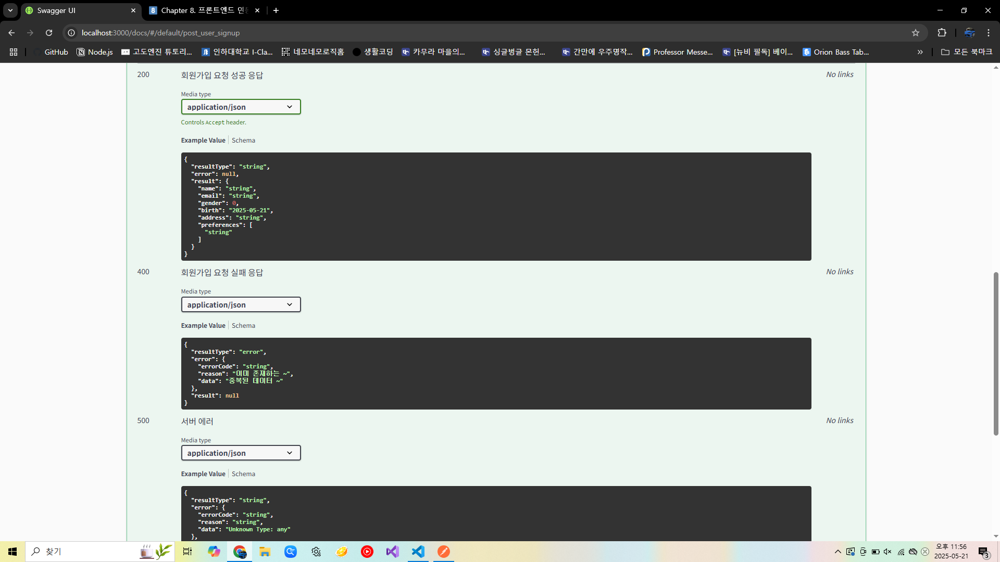

- 미션 기록
    
    ```jsx
    export const handleUserSignUp = async (req, res, next) => {
        /*
        #swagger.summary = '회원가입 요청 api';
        #swagger.requestBody = {
            required: true,
            content: {
                "application/json": {
                    schema: {
                        type: "object",
                        properties: {
                            email: { type: "string" },
                            name: { type: "string" },
                            gender: { type: "number" },
                            birth: { type: "string", format: "date" },
                            address: { type: "string" },
                            phoneNumber: { type: "string" },
                            preferences: { type: "array", items: { type: "number"} }
                        }
                    }
                }
            }
        };
        #swagger.responses[200] = {
            description: "회원가입 요청 성공 응답",
            content: {
                "application/json": {
                    schema: {
                        type: "object",
                        properties: {
                            resultType: { type: "string" },
                            error: { type: "object", nullable: true, example: null },
                            result : {
                                type: "object",
                                properties: {
                                    name: { type: "string" },
                                    email: { type: "string" },
                                    gender: { type: "number" },
                                    birth: { type: "string", format: "date" },
                                    address: { type: "string" },
                                    preferences: {
                                        type: "array",
                                        items: { type: "string" }
                                    }
                                }
                            }
                        }
                    }
                }
            }
        };
        #swagger.responses[400] = {
            description: "회원가입 요청 실패 응답",
            content: {
                "application/json": {
                    schema: {
                        type: "object",
                        properties: {
                            resultType: { type: "string", example: "error" },
                            error: {
                                type: "object",
                                properties: {
                                    errorCode: { type: "string" },
                                    reason: { type: "string", example: "이미 존재하는 ~" },
                                    data: { type: "string", example: "중복된 데이터 ~" },
                                }
                            },
                            result: {
                                type: "object", nullable: true, example: null
                            }
                        }
                    }
                }
            }
        };
        #swagger.responses[500] = {
            description: "서버 에러",
            content: {
                "application/json": {
                    schema: {
                        type: "object",
                    properties: {
                        resultType: { type: "string" },
                        error: { 
                            type: "object",
                            properties: {
                                errorCode: { type: "string" },
                                reason: { type: "string" },
                                data: { type: "string" }
                            },
                        },
                        result: {
                            type: "object", nullable: true, example: null
                        }
                    }
                    }
                }
            }
        };
        */
        console.log('회원가입 요청.');
        console.log("body: ", req.body);
        
        try{
            const user = await userSignUp(bodyToUser(req.body));
            res.status(StatusCodes.OK).success(user);
        }catch(err){
            next(err);
        }
    };
    ```
    
    