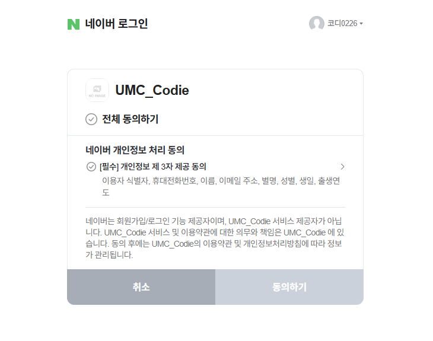

- 미션 기록
    - 네이버 로그인 구현
        
        passport-naver-v2 npm 패키지 이용
        
        https://github.com/parkoon/passport-naver-v2?tab=readme-ov-file
        
        - 네이버 API 설정
            
            
            
            프로파일에서 이메일, 유저 닉네임, 성별, 생일, 전화번호 등의 데이터까지 모두 받아올 수 있다.
            
        
        ```jsx
        export const naverStrategy = new NaverStrategy(
            {
                clientID: process.env.PASSPORT_NAVER_CLIENT_ID,
                clientSecret: process.env.PASSPORT_NAVER_CLIENT_SECRET,
                callbackURL: "http://localhost:3000/oauth2/callback/naver",
                state: true,
            },
            (accessToken, refreshToken, profile, cb) => {
                return naverVerify(profile)
                .then((user) => cb(null, user))
                .catch((err) => cb(err));
            }
        );
        
        const naverVerify = async (profile) => {
            const email = profile.email;
            const user = await prisma.user.findFirst({where: {email}});
        
            if(user !== null) {
                return {id: user.id, email: user.email, username: user.username};
            }
        
            const created = await prisma.user.create({
                data: {
                    email,
                    username: profile.nickname,
                    gender: -1,
                    address: "추후 수정",
                    phoneNumber: profile.mobile,
                    birth: new Date(1971, 0, 1),
                }
            });
        
            return {id: created.id, email: created.email, username: created.username};
        };
        ```
        
        - 결과
            
            
            
            
            
            유저가 성공적으로 가입되었다.